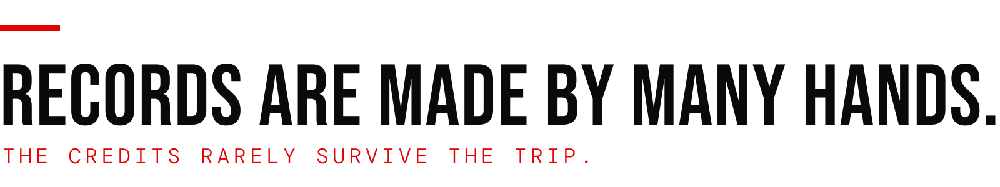

<picture>
  <source media="(prefers-color-scheme: dark)" srcset="./assets/header-dark.svg">
  
</picture>

I'm Juan. I've spent 15+ years making records between Buenos Aires and the U.S., founded Panacea Studio along the way, and have worked on about 110 releases since 2022 ([credits verified](https://juanlentino.com/music/)). Now I research how to prove who made what, at the moment it's made.

The short version: **detection guesses, provenance proves.** I write the papers, then build the small open tools that test them: [**Sealed Record**](https://github.com/juanlentino/sealedrecord), [a public provenance ledger](https://github.com/juanlentino/signal-and-noise-provenance) where every note I publish is signed and appended, [rights signals](https://github.com/juanlentino/sn-rights-signals-worker) serving one machine-readable AI rights position at the edge, a [connector for TypeSafe Jev](https://github.com/juanlentino/jev-connector) with typed, confidence-scored answers for WordPress, and [Signal & Noise](https://github.com/juanlentino/signal-and-noise) + [tools](https://github.com/juanlentino/signal-and-noise-tools), the brutalist theme and plugin behind juanlentino.com.

**Sealed Record** checks a sealed session record end to end: hash chain, Ed25519 signatures, time receipts, and whether an audio file is the take it claims to be. No account, no server. Prefer a browser? [Drop a record here.](https://juanlentino.github.io/sealedrecord/)

> [!TIP]
> **Try it** in three commands:
> ```bash
> curl -sO https://raw.githubusercontent.com/juanlentino/sealedrecord/main/vectors/record.json
> curl -sO https://raw.githubusercontent.com/juanlentino/sealedrecord/main/vectors/take.wav
> npx sealedrecord verify record.json take.wav
> ```

**Latest notes**
<!-- BLOG-POST-LIST:START -->
- [Before you opt in to an AI music platform](https://juanlentino.com/notes/before-you-opt-in-to-an-ai-music-platform/)
- [Revocation unsigns nothing](https://juanlentino.com/notes/revocation-unsigns-nothing/)
- [The form is not part of the process](https://juanlentino.com/notes/the-form-is-not-part-of-the-process/)
<!-- BLOG-POST-LIST:END -->

**Reading list:** start at the [**provenance hub**](https://juanlentino.com/provenance/): the whole argument, in plain language. Then the papers on SSRN: [Provenance Over Detection](https://ssrn.com/abstract=6402298) · [Provenance as Substrate](https://ssrn.com/abstract=6730343) · [Provenance Without Institutions](https://ssrn.com/abstract=7456638). Or the [**notes**](https://juanlentino.com/notes/): shorter essays on the same questions.

Upstream contributor to [**WordPress/openstation**](https://github.com/WordPress/openstation) (wp-admin as a desktop OS), [**AllTerrain Forms**](https://github.com/AllTerrainDeveloper/forms), and [**MAIA**](https://github.com/AllTerrainDeveloper/MAIA-Media-Asset-Interface-Administration): [see the merged pull requests](https://github.com/search?q=author%3Ajuanlentino+is%3Apr+is%3Amerged+-user%3Ajuanlentino&type=pullrequests). All of it engineered with Claude as a pair programmer.

<p>


<a href="https://orcid.org/0009-0006-8151-5920"></a>
<a href="https://juanlentino.com"></a>

</p>
